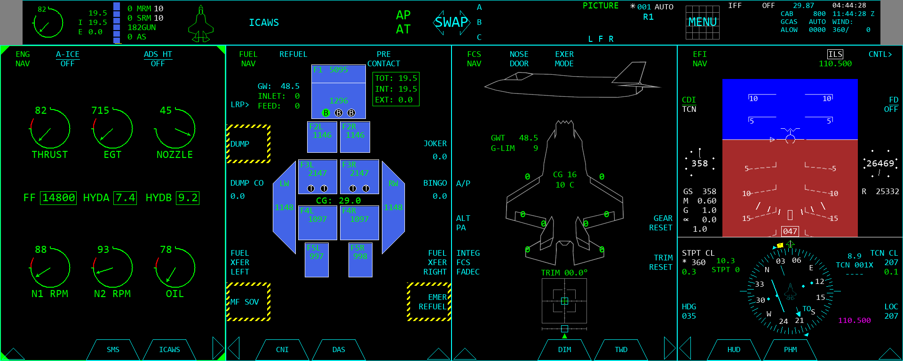
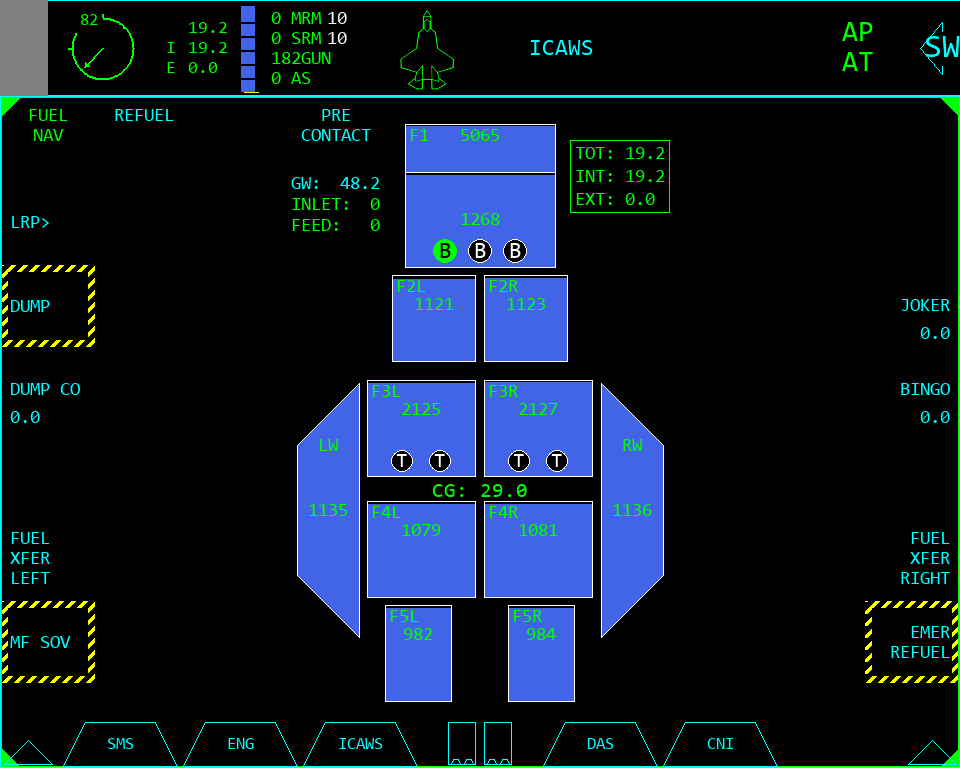
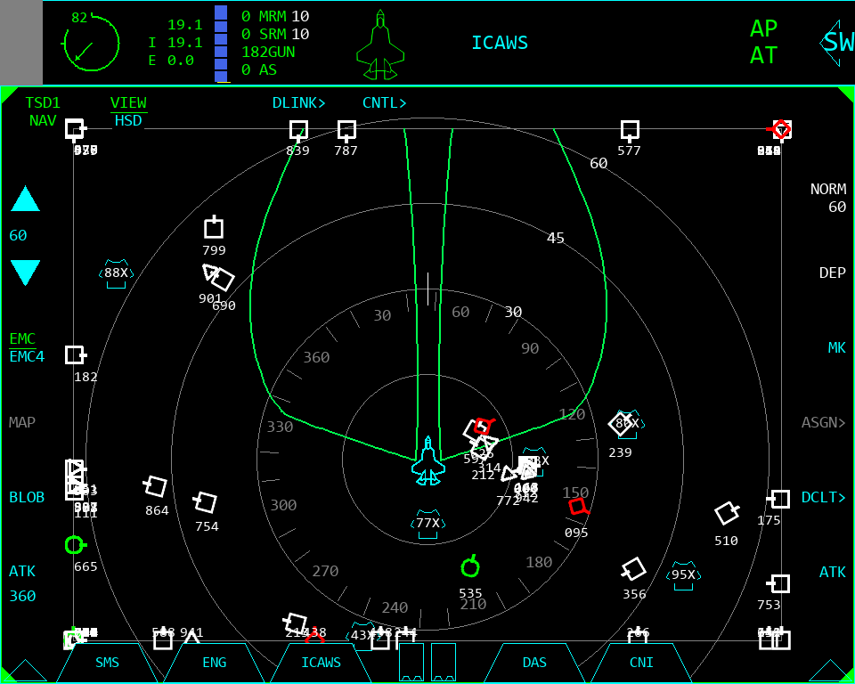
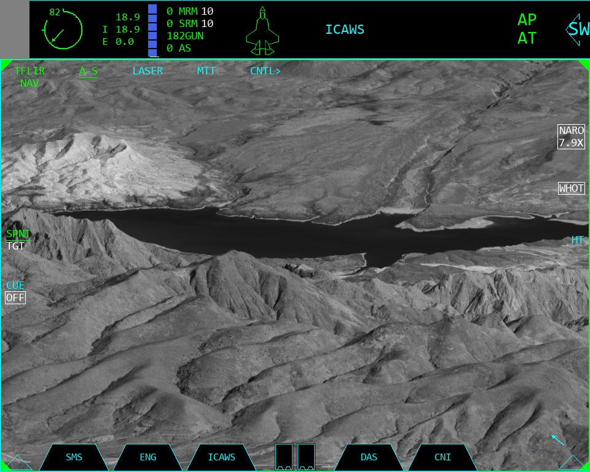
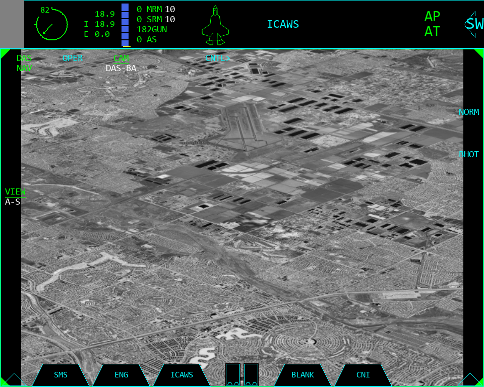
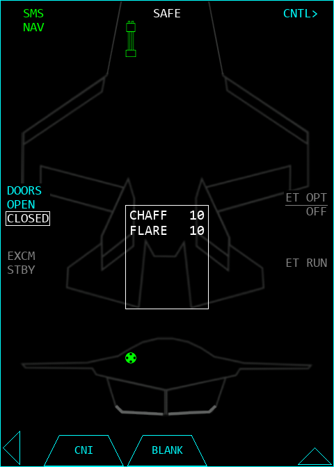
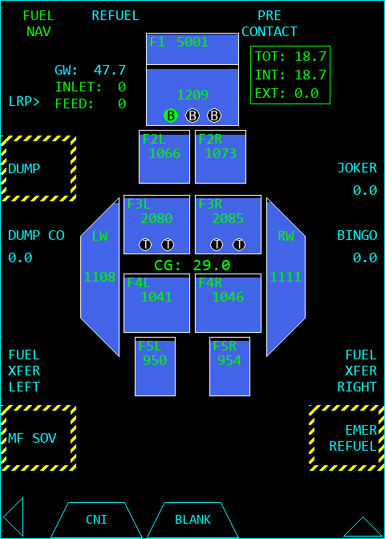
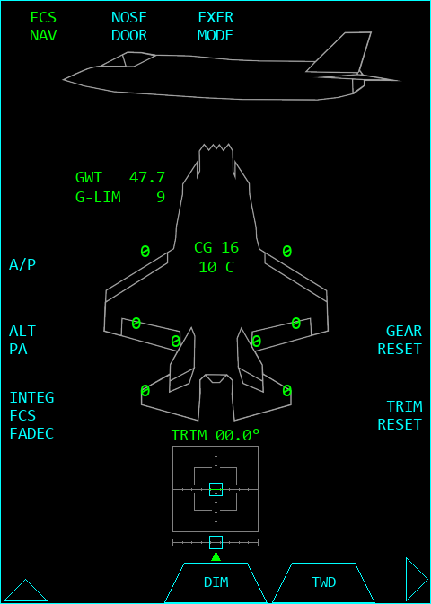
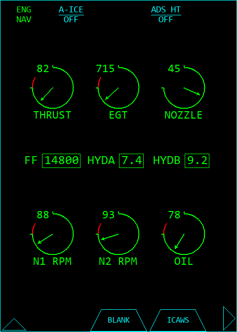
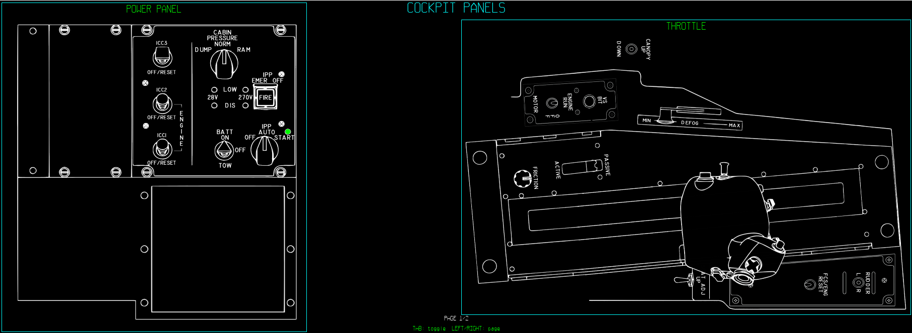

# F-35 PCD Simulator

An F-35 Panoramic Cockpit Display simulator written in Python/Pygame.

This project includes modular display formats, cockpit panel simulation, TSD/ASR/TWD display logic, TFLIR/DAS Cesium-backed 3D world rendering, ADS-B track ingestion, datalink relay support, cockpit audio, and plugin-driven PMD extensions.

## Features

- Multi-portal PCD layout with expandable 5x5, 5x7, 10x5, and 10x7 formats
- TSD, ASR, TWD, SMS, FCS, FUEL, ENG, EFI, HUD, CNI, COMM, PHM, ICAWS, TFLIR, DAS, and supporting formats
- Cesium-backed TFLIR/DAS world rendering through `3DWorld.py` and `DASWorld.py`
- ADS-B ingestion for live air tracks
- Datalink relay support
- Cockpit switch/engine/ICAW audio
- PMD plugin support


## Screenshots

Add screenshots under `docs/screenshots/` and replace the placeholder paths below.

### Full PCD Layout



### Expanded Portal / Multi-Format View



### TSD / Tactical Situation Display



### TFLIR / DAS World Rendering




### Stores, Fuel, FCS, and Engine Pages






### Cockpit Panels / Debug Pages




## Requirements

- Python 3.11+ recommended
- Windows is the primary target
- Linux/WSL support is partially supported, but WebEngine/WebGL dependencies may require extra system packages

Install runtime dependencies:

```bash
python -m pip install -r requirements/runtime.txt
```

For development tools:

```bash
python -m pip install -r requirements/dev.txt
```

Or install everything:

```bash
python -m pip install -r requirements/all.txt
```

## Running From Source

```bash
python main.py
```

## Cesium Token

TFLIR/DAS world rendering requires a Cesium Ion token for full imagery/world access. This is a free token you can get at https://ion.cesium.com/signin/

You can enter the token in the simulator through the PMD debug/token menu, or add it to the generated `pcd_settings.json`:

```json
{
  "cesium_ion_token": "YOUR_TOKEN_HERE"
}
```

## Project Layout

```text
main.py                 Root simulator entry point
scripts/                Modularized simulator support code
scripts/format_defs/    Individual display format implementations
icons/                  Display and cockpit icons
models/                 3D model assets
SFX/                    Audio effects
requirements/           Python dependency lists
stores.json             Stores/loadout data
```

Compiled builds may include private distribution secret material locally, but those files are not required for normal source execution and should not be published.

